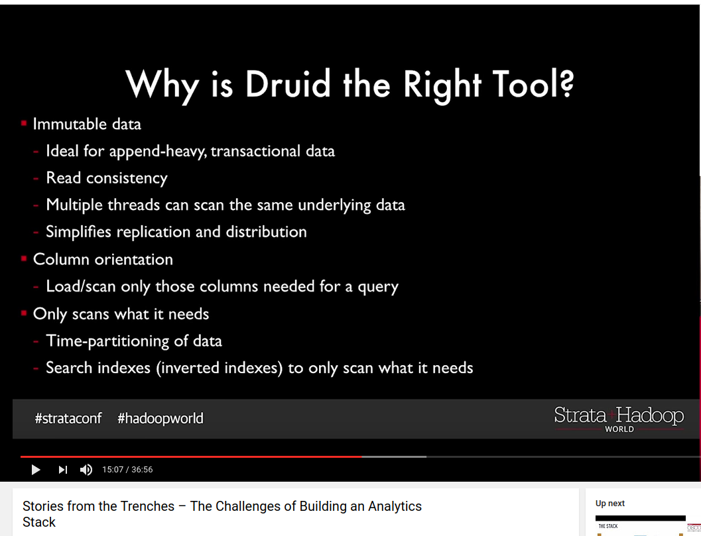

# Druid

## Stories from the Trenches – The Challenges of Building an Analytics Stack

https://www.youtube.com/watch?v=Sz4w75xRrYM

- Immutable data
- In Memory is Overrated
  - mmap + SSD
  - cost of scaling CPU << cost of adding RAM
  - decompression on the fly (LZF, Snappy, LZ4)
- Low Latency vs High throughput
  - combine batch + streaming
  - immutable made it easy to combine the two ingestion methods
  - Makes for easy backfill and re-processing
  - Historical Node
  - Real-time Node
- Not All Data is Created Equal
  - user really care about recent data
  - user still want to run quarterly report
  - large queries create bottlenecks and resource contention
- Smarter Rebalancing
- Create Data Tiers
- Addressing Multitenancy
  - HyperLogLog sketches
  - Approximate top-k
  - Approximate histograms (monitoring)
- Monitoring
  - Use Druid to monitor Druid
- **Use cases should define engineering**

## Druid: A Real-time Analytical Data Store

- time series data with both numeric and text value
- a set dimension columns
  - KairosDB etc. are not multi dimension, strictly speaking
  - query over any arbitrary combination of dimensions

Features for a dashboard

- query latency
- multi-tenant
- HA
- make business decisions in "real-time"

### Architecture

> The name Druid comes from the Druid class in many role-playing games: it is a
shape-shifter, capable of taking on many different forms to fulfill
various different roles in a group.

- real time node
- historical node
- broker node
- coordinator node

Real-time Node

- use ZK for online state and data range?
- Row store when in JVM heap-based buffer
- persist in-memory indexes to disk periodically/based on threshold of rows
  - [ ] TODO: just indexes? how does Druid know which node to build index
  - column oriented storage format
- [ ] load persisted indexes into off-heap memory
- immutable block **segment** into deep storage (s3, HDFS)
- **consume Kafka**
  - buffer (and crash recovery)
  - single end point for multiple real-time nodes to read events

Historical Nodes

- load, drop, serve immutable segments
- use ZK for online state and data range
- download segment from deep storage, first check local cache
- **group into Tiers**

Broker Nodes

- broker nodes act as query routers to historical and real-time nodes
- merge partial results
- LRU cache

Coordinator Nodes
